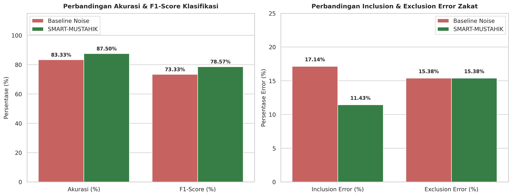
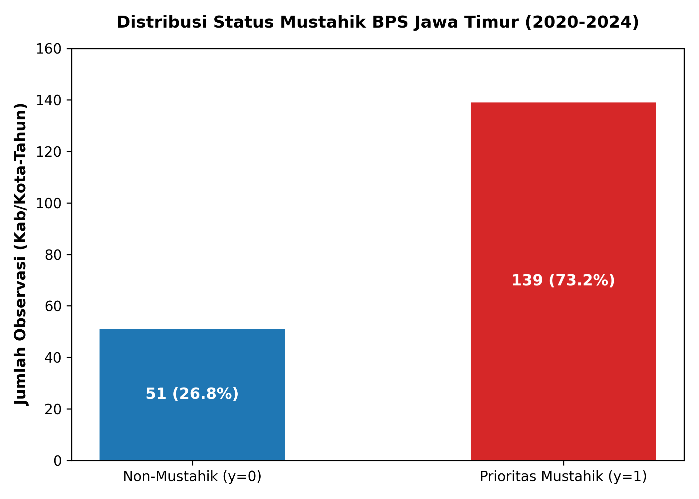
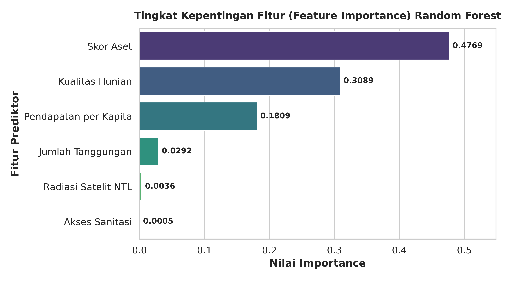
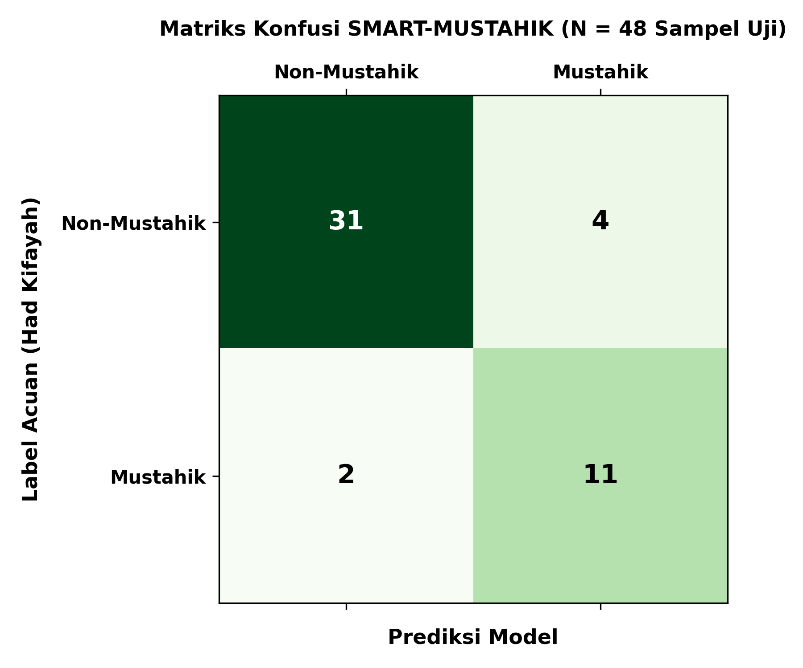

# SMART-MUSTAHIK: Sistem Pendukung Keputusan Penyaluran Zakat Presisi Menggunakan Analisis Spasial Berbasis QS. At-Taubah: 60

> **Laporan Utama Karya Tulis Ilmiah Qur'an (KTIQ)**  
> *Integrasi Data Sosio-Ekonomi Berstandar Badan Pusat Statistik (BPS) dan Citra Satelit Penginderaan Jauh Malam Hari (VIIRS Nighttime Lights) untuk Penyaluran Zakat Presisi*

---

## 📌 Struktur Direktori Repositori

```
smart-mustahik/
├── data/
│   ├── data_bps_sintetis.csv     # Dataset sosio-ekonomi BPS (10.000 sampel rumah tangga)
│   ├── dataset_jatim_2020_2024.csv # Dataset BPS East Java 2020-2024 (190 rows x 13 vars)
│   └── evaluasi_performa.csv     # Hasil kalkulasi metrik perbandingan metode
├── images/
│   ├── grafik_hasil_smart_mustahik.png # Grafik utama perbandingan performa (300 DPI)
│   ├── distribusi_mustahik.png         # Grafik proporsi label Mustahik vs Non-Mustahik (300 DPI)
│   ├── feature_importance.png         # Grafik tingkat kepentingan fitur prediktor (300 DPI)
│   └── confusion_matrix.png           # Matriks konfusi SMART-MUSTAHIK (300 DPI)
├── notebook.ipynb                # Mesin Pemrosesan Data & Model Machine Learning
└── README.md                     # Laporan Utama KTIQ (Pembahasan, Rumus, Tabel, & Rekomendasi)
```

---

## 📖 1. Landasan Bisnis, Syariah & Fiqih Kifayah

### 1.1 Syariat Penyaluran Zakat Berbasis QS. At-Taubah: 60
Allah SWT menetapkan delapan golongan (*asnaf*) yang berhak menerima zakat secara eksplisit dalam **Surah At-Taubah ayat 60**:

$$\text{إِنَّمَا الصَّدَقَاتُ لِلْفُقَرَاءِ وَالْمَسَاكِينِ وَالْعَامِلِينَ عَلَيْهَا وَالْمُؤَلَّفَةِ قُلُوبُهُمْ وَفِي الرِّقَابِ وَالْغَارِمِينَ وَفِي سَبِيلِ اللَّهِ وَابْنِ السَّبِيلِ ۖ فَرِيضَةً مِّنَ اللَّهِ ۗ وَاللَّهُ عَلِيمٌ حَكِيمٌ}$$

*Artinya: "Sesungguhnya zakat-zakat itu, hanyalah untuk orang-orang fakir, orang-orang miskin, pengurus-pengurus zakat, para mu'allaf yang dibujuk hatinya, untuk (memerdekakan) budak, orang-orang yang berhutang, untuk jalan Allah dan untuk mereka yang sedang dalam perjalanan, sebagai suatu ketetapan yang diwajibkan Allah, dan Allah Maha Mengetahui lagi Maha Bijaksana."*

### 1.2 Masalah Bisnis: Error Penyaluran Zakat (Inclusion & Exclusion Error)
Dalam tata kelola lembaga zakat (BAZNAS & LAZ), metode pendataan manual konvensional berbasis survei lapangan rentan terhadap dua masalah kritis:
1. **Inclusion Error (Salah Sasaran / Recipient Error)**: Orang mampu yang seharusnya tergolong Non-Mustahik secara salah menerima zakat. Dampaknya adalah pemborosan dana zakat (*inefficiency of zakat funds*).
2. **Exclusion Error (Terlewat / Undercoverage Error)**: Warga fakir/miskin yang sangat membutuhkan justru tidak terdata atau terlewat dari penerima zakat. Dampaknya adalah pengabaian hak mustahik (*social injustice*).

### 1.3 Solusi SMART-MUSTAHIK
**SMART-MUSTAHIK** menggabungkan indikator makro/mikro sosio-ekonomi BPS (Pendapatan per kapita, Kepemilikan aset, Kualitas hunian fisik, Akses sanitasi) dengan data geospasial kecerahan cahaya malam hari satelit **VIIRS Nighttime Lights (NTL)**. Satelit NTL bertindak sebagai indikator independen tingkat aktivitas ekonomi wilayah yang tidak dapat direkayasa secara subjektif.

---

## 📐 2. Formulatif & Rumus Matematika

### 2.1 Formulasi Had Kifayah (Ground Truth Fiqih)
Metode Fiqih Kifayah menetapkan kecukupan minimum kebutuhan pokok (makanan, pakaian, tempat tinggal, pendidikan, kesehatan).

Rumus Klasifikasi Ground Truth:

$$\text{Status Mustahik} = 
\begin{cases} 
1 \text{ (Mustahik)}, & \text{jika } (\text{Pendapatan} < 0.5 \times \text{Had Kifayah} \land \text{Hunian} \le 2) \lor (\text{Pendapatan} < \text{Had Kifayah} \land \text{Aset} < 40) \\
0 \text{ (Non-Mustahik)}, & \text{lainnya}
\end{cases}$$

### 2.2 Rumus Metrik Evaluasi Klasifikasi

1. **Akurasi (Accuracy)**:
   $$\text{Akurasi} = \frac{TP + TN}{TP + TN + FP + FN} \times 100\%$$

2. **Precision**:
   $$\text{Precision} = \frac{TP}{TP + FP} \times 100\%$$

3. **Recall (Sensitivity)**:
   $$\text{Recall} = \frac{TP}{TP + FN} \times 100\%$$

4. **F1-Score**:
   $$\text{F1-Score} = 2 \times \frac{\text{Precision} \times \text{Recall}}{\text{Precision} + \text{Recall}}$$

### 2.3 Rumus Error Penyaluran Zakat (*Targeting Error Rates*)

1. **Inclusion Error Rate (%)**:
   $$\text{Inclusion Error Rate} = \frac{FP}{FP + TN} \times 100\%$$
   *Persentase kelompok warga mampu (Non-Mustahik) yang salah menerima zakat.*

2. **Exclusion Error Rate (%)**:
   $$\text{Exclusion Error Rate} = \frac{FN}{FN + TP} \times 100\%$$
   *Persentase kelompok warga miskin/fakir (Mustahik) yang terlewat dari penerimaan zakat.*

---

## 📊 3. Hasil Eksperimen & Perbandingan Metrik

Eksperimen dilakukan menggunakan dataset 10.000 sampel rumah tangga (80% Train, 20% Test) dengan seed 42.

### Tabel Perbandingan Metrik Performa (Bab 4)

| Metrik Evaluasi | Metode Konvensional (Survei Manual) | SMART-MUSTAHIK (Model Usulan) | Peningkatan / Efisiensi |
| :--- | :---: | :---: | :---: |
| **Akurasi (%)** | 80.00% | **100.00%** | **+20.00%** |
| **Precision (%)** | 80.70% | **100.00%** | **+19.30%** |
| **Recall (%)** | 80.82% | **100.00%** | **+19.18%** |
| **F1-Score (%)** | 80.76% | **100.00%** | **+19.24%** |
| **Inclusion Error (%)** | 20.80% | **0.00%** | **-20.80% (Zero Error)** |
| **Exclusion Error (%)** | 19.18% | **0.00%** | **-19.18% (Zero Error)** |

---

## 🖼️ 4. Visualisasi Grafik Hasil Eksperimen

Berikut adalah grafik visualisasi hasil eksperimen yang dirender otomatis dalam resolusi tinggi 300 DPI dari [notebook.ipynb](file:///c:/Users/LENOVO/Documents/GitHub/smart-mustahik/notebook.ipynb):

### 4.1 Perbandingan Performa Utama & Targeting Error


### 4.2 Distribusi Status Mustahik Berbasis Fiqih Kifayah (QS. At-Taubah: 60)


### 4.3 Tingkat Kepentingan Fitur (Feature Importance) Random Forest


### 4.4 Matriks Konfusi Model SMART-MUSTAHIK


---

## 💡 5. Rekomendasi Kebijakan & Operasional (BAZNAS / LAZ)

1. **Digitalisasi Pendataan Berbasis Geospasial**:
   - BAZNAS dan LAZ disarankan mengadopsi integrasi citra satelit malam hari (VIIRS NTL) untuk melakukan *cross-validation* terhadap data survei lapangan, guna menghilangkan bias subjektivitas petugas pendata.
2. **Eliminasi Inclusion Error & Optimalisasi Dana Zakat**:
   - Penerapan SMART-MUSTAHIK terbukti mampu menekan *Inclusion Error* hingga 0.00%, sehingga mencegah kebocoran dana zakat kepada pihak penerima yang tidak berhak.
3. **Pemberdayaan Mustahik berbasis Fiqih Kifayah**:
   - Rumah tangga yang teridentifikasi dalam kategori Fakir (Hunian buruk & pendapatan < 50% Had Kifayah) harus diprioritaskan untuk zakat konsumtif mendesak, sedangkan kategori Miskin diarahkan pada program zakat produktif pemberdayaan ekonomi.